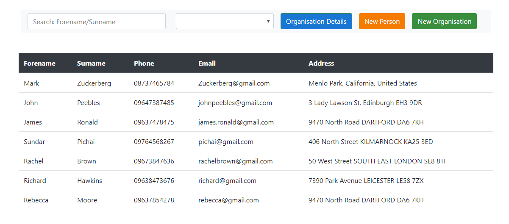
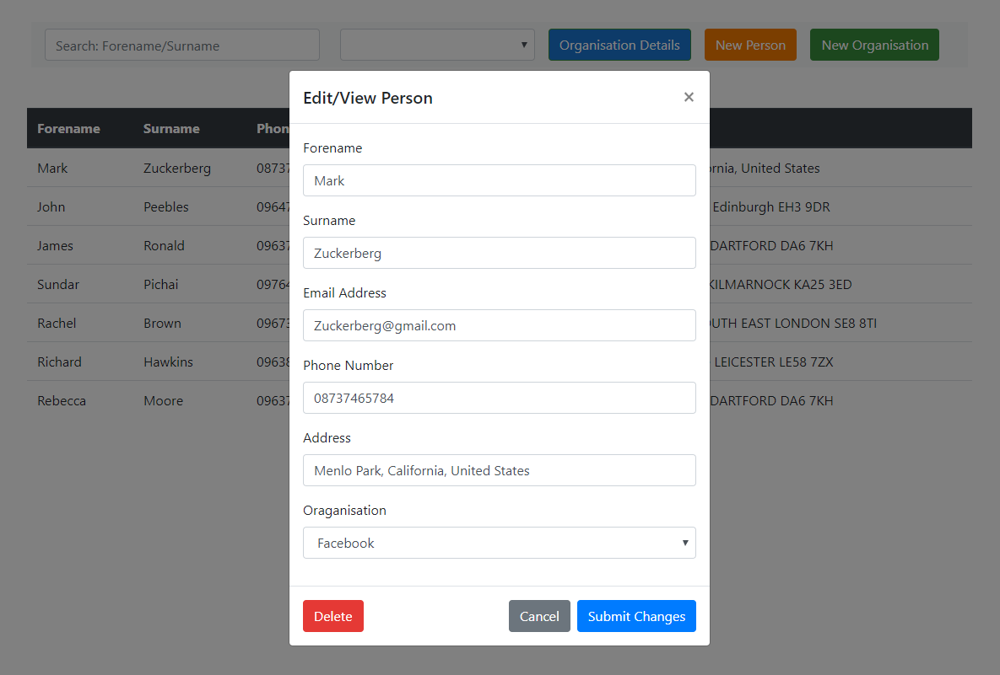

# Address Book

###  Specifications:
* Add/Edit/Delete
* Sort/Add Contacts by Organisation

* Mongo DB
* Vanilla UI

### Quick start

#### Start Local Deployment
* First "npm install"
* Add Mongo password to nodemon.js
* To deploy locally "npm start" on the root folder
* Go to "http://localhost:3000"

#### Cloud Deployment
* https://administrate-bao.herokuapp.com/
